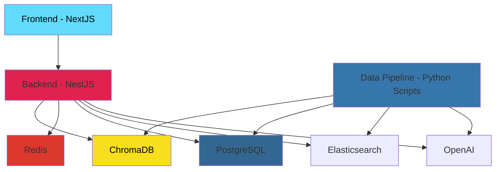
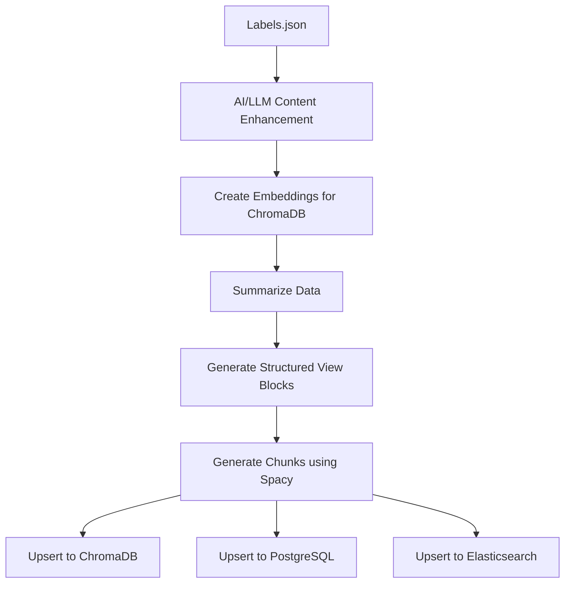

# Medication Search for PrescriberPoint

    Disclaimer: This readme was generated with the help of AI. But I did ask it to type each detail instead of asking it to generate the content randomly.

## Setup Instructions

### Environment Configuration

1. **OpenAI API Key**: Set the `OPENAI_API_KEY` environment variable in the `docker/.env` file
2. **Environment Template**: See [docker/.env.example](docker/.env.example) for the complete list of required environment variables

### Install Spacy en_core_web_sm for the python scripts

```bash
python -m spacy download en_core_web_sm
```

### Running the Application

To start all services, run the following command from the project root:

```bash
docker compose up --build
```

This will build and start all the required services:
- Frontend (NextJS) on port 8080
- Backend (NestJS) on port 3000
- PostgreSQL database on port 5432
- Redis cache on port 6379
- ChromaDB vector database on port 8000

## System Design

The application follows a microservices architecture with the following components:



### Architecture Overview

- **Frontend (NextJS)**: React-based web application providing the user interface
- **Backend (NestJS)**: Node.js API server handling business logic and data processing
- **ChromaDB**: Vector database for similarity search and AI-powered features
- **Redis**: In-memory cache for performance optimization
- **PostgreSQL**: Primary relational database for structured data storage
- **Data Pipeline**: Python scripts for data processing, enrichment, and migration between databases

## Backend

The backend is built with NestJS and provides REST API endpoints for the following functionality:

### Core Features
- **AI Chat Requests**: Handles conversational AI interactions with rate limiting to prevent OpenAI API usage limits
- **Medication Search**: Provides search functionality across medication databases
- **Medication Retrieval**: REST endpoints for fetching detailed medication information with Redis caching for improved performance

### API Security & Performance
- **Rate Limiting**: All endpoints implement rate limiting to ensure application stability and prevent abuse
- **Chat API Protection**: Specialized rate limiters on chat endpoints to manage OpenAI API usage and prevent hitting usage limits
- **Caching**: Redis integration for improved response times and reduced database load, specifically utilized for medication data retrieval

## Frontend

The frontend is built with NextJS and optimized for search engine visibility and user experience:

### SEO & Performance Optimization
- **SEO-First Design**: Medication pages are built with SEO and GEO (Geographic) considerations in mind
- **Minimal HTML Content**: Server-side generated pages with minimal download size for optimal performance
- **SEO Score**: Custom routine testing achieved a score of 93 out of 100 for search engine optimization
- **Rich Metadata**: Includes comprehensive meta tags and JSON-LD structured data for enhanced search engine understanding

### Technical Features
- **Server-Side Generation**: Pages are pre-rendered for improved loading speeds and SEO benefits
- **Responsive Design**: Optimized for all device types and screen sizes
- **Modern UI/UX**: Built with modern React patterns and Tailwind CSS for a clean, professional interface

## RAG (Retrieval-Augmented Generation)

The application leverages AI-powered RAG systems to enhance medication data processing and presentation:

### Content Enhancement & Processing
- **AI Content Enhancement**: Utilizes AI to enrich and improve medication descriptions and metadata
- **Data Summarization**: Intelligent summarization of complex medication information for better user comprehension
- **Content Structuring**: AI-driven organization of medication data into structured block formats

### Security & XSS Prevention
- **Block Structure Security**: Content is structured in secure block formats to prevent Cross-Site Scripting (XSS) attacks
- **Sanitized Content**: AI-processed content undergoes thorough sanitization before rendering
- **Safe Rendering**: All AI-generated content is safely rendered through controlled block structures

### Vector Search Integration
- **ChromaDB Integration**: Enhanced content is indexed in ChromaDB for similarity search capabilities
- **Product Similarity**: Vector searching enables finding similar medications based on composition, effects, and characteristics
- **AI Chat Correlation**: Vector search powers the AI chat system to correlate responses with relevant medication data
- **Semantic Search**: AI-processed content enables semantic search across medication databases
- **Contextual Retrieval**: RAG system provides contextually relevant medication information

## Data Pipeline

The data pipeline processes and enriches medication data through a series of AI-powered transformations:



### Pipeline Flow

1. **Initial Processing**: Raw medication data from `Labels.json` is loaded and prepared for processing
2. **Content Enhancement**: GPT-4o enriches and improves medication descriptions, metadata, and contextual information
3. **Embedding Generation**: Enhanced content is converted into vector embeddings optimized for ChromaDB storage
4. **Data Summarization**: Complex medication information is intelligently summarized for better user comprehension
5. **Block Structure Creation**: Content is organized into structured view blocks for secure frontend rendering
6. **Chunking with Spacy**: Natural language processing using Spacy library creates semantic chunks for improved search capabilities
7. **Database Storage**: Processed data is simultaneously upserted to both ChromaDB (for vector search) and PostgreSQL (for structured queries)

### Key Features
- **AI-Powered Enhancement**: GPT-4o ensures high-quality content enrichment
- **Dual Database Storage**: Optimized storage for both vector similarity search and traditional relational queries
- **Security-First**: Structured blocks prevent XSS while maintaining rich content presentation
- **Scalable Processing**: Pipeline handles large datasets efficiently with proper chunking and summarization

## Design Decisions

The application architecture reflects several key design decisions that balance performance, security, and user experience:

### Technology Stack Choices
- **NextJS Frontend**: Chosen for server-side rendering capabilities, excellent SEO support, and modern React development experience
- **NestJS Backend**: Selected for its robust TypeScript support, built-in dependency injection, and enterprise-grade architecture patterns
- **ChromaDB + PostgreSQL**: Dual database approach enables both vector similarity search and traditional relational queries
- **Redis Caching**: In-memory caching layer reduces database load and improves response times for frequently accessed medication data
- **GPT-4o AI Model**: Selected for its extended context window and superior reasoning capabilities, enabling more comprehensive content processing and analysis
- **Low Temperature Settings**: Most AI operations use low temperature settings to increase determinism and ensure consistent, reliable output across content enhancement and summarization tasks

### Security-First Architecture
- **Block Structure Rendering**: All AI-generated content is structured in secure blocks to prevent XSS attacks while maintaining rich presentation
- **Rate Limiting**: Comprehensive rate limiting protects against API abuse and manages external service usage (OpenAI)
- **Content Sanitization**: AI-processed content undergoes thorough sanitization before rendering

### Performance Optimization
- **Server-Side Generation**: Pre-rendered pages improve loading speeds and SEO performance
- **Vector Search Integration**: ChromaDB enables semantic search and AI chat correlation for better user experience
- **Dual Database Strategy**: Optimized storage patterns for different query types (similarity vs. structured)

### Scalability Considerations
- **Microservices Architecture**: Modular design allows independent scaling of frontend, backend, and data pipeline components
- **AI-Powered Processing**: Automated content enhancement and summarization reduces manual data processing overhead
- **Efficient Data Pipeline**: Batch processing with proper chunking handles large medication datasets effectively

## Limitations & Future Enhancements

The current implementation has several limitations, some due to scope or time constraints, that present opportunities for future improvements:

### AI Assistant Improvements
- **Enhanced Interactions**: The AI chat assistant requires refinement for more sophisticated conversational capabilities and better context understanding
- **Response Quality**: Improved prompt engineering and response generation for more accurate medication-related interactions

### Data Pipeline Automation
- **Temporal Integration**: The data pipeline can be fully automated using Temporal for better workflow orchestration, error handling, and retry mechanisms
- **Scheduled Processing**: Automated data refresh and content enhancement cycles

### Database Optimization
- **Field Optimization**: Database schema and field structures can be optimized for better query performance and storage efficiency
- **Indexing Strategy**: Enhanced indexing for improved search performance across large medication datasets

### Search Capabilities Enhancement
- **ElasticSearch Integration**: Current medication search is basic and can be significantly improved by introducing ElasticSearch for advanced search capabilities, fuzzy matching, and complex query support
- **Advanced Search Features**: Implementation of faceted search, autocomplete, and relevance scoring for better user experience

### Rate Limiting Enhancements
- **Token-Based Limiting**: Current rate limiters can be improved to use tokens used versus tokens available instead of API calls, as OpenAI uses both for limiting
- **Dynamic Rate Adjustment**: Adaptive rate limiting based on usage patterns and API quotas

### Advanced AI Integration
- **Vertex AI Integration**: Integration with Google's Vertex AI can provide larger context windows and even better SEO-quality content production
- **Multi-Model Approach**: Leveraging multiple AI models for specialized tasks (content generation, summarization, classification)

### Performance & Scalability
- **Load Balancing**: Improved load balancing for high-traffic scenarios
- **Monitoring & Observability**: Enhanced logging and monitoring for better system visibility
