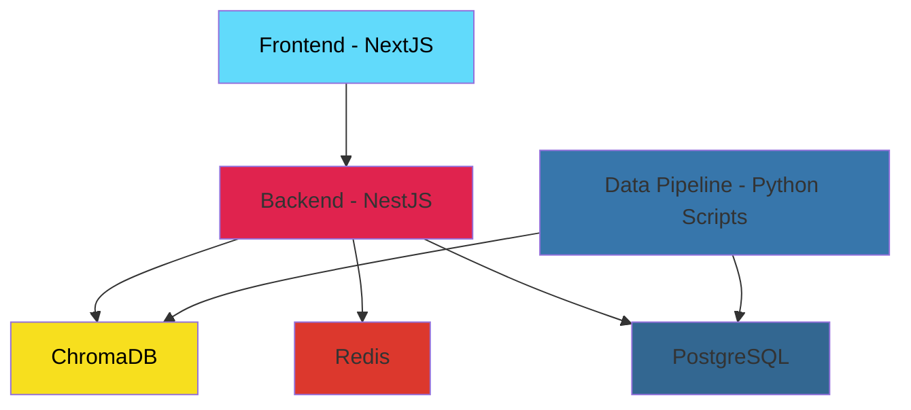

# Medication Search for PrescriberPoint

## System Design

The application follows a microservices architecture with the following components:



### Architecture Overview

- **Frontend (NextJS)**: React-based web application providing the user interface
- **Backend (NestJS)**: Node.js API server handling business logic and data processing
- **ChromaDB**: Vector database for similarity search and AI-powered features
- **Redis**: In-memory cache for performance optimization
- **PostgreSQL**: Primary relational database for structured data storage
- **Data Pipeline**: Python scripts for data processing, enrichment, and migration between databases

## Backend

The backend is built with NestJS and provides REST API endpoints for the following functionality:

### Core Features
- **AI Chat Requests**: Handles conversational AI interactions with rate limiting to prevent OpenAI API usage limits
- **Medication Search**: Provides search functionality across medication databases
- **Medication Retrieval**: REST endpoints for fetching detailed medication information with Redis caching for improved performance

### API Security & Performance
- **Rate Limiting**: All endpoints implement rate limiting to ensure application stability and prevent abuse
- **Chat API Protection**: Specialized rate limiters on chat endpoints to manage OpenAI API usage and prevent hitting usage limits
- **Caching**: Redis integration for improved response times and reduced database load, specifically utilized for medication data retrieval

## Frontend

The frontend is built with NextJS and optimized for search engine visibility and user experience:

### SEO & Performance Optimization
- **SEO-First Design**: Medication pages are built with SEO and GEO (Geographic) considerations in mind
- **Minimal HTML Content**: Server-side generated pages with minimal download size for optimal performance
- **SEO Score**: Custom routine testing achieved a score of 93 out of 100 for search engine optimization
- **Rich Metadata**: Includes comprehensive meta tags and JSON-LD structured data for enhanced search engine understanding

### Technical Features
- **Server-Side Generation**: Pages are pre-rendered for improved loading speeds and SEO benefits
- **Responsive Design**: Optimized for all device types and screen sizes
- **Modern UI/UX**: Built with modern React patterns and Tailwind CSS for a clean, professional interface

## RAG (Retrieval-Augmented Generation)

The application leverages AI-powered RAG systems to enhance medication data processing and presentation:

### Content Enhancement & Processing
- **AI Content Enhancement**: Utilizes AI to enrich and improve medication descriptions and metadata
- **Data Summarization**: Intelligent summarization of complex medication information for better user comprehension
- **Content Structuring**: AI-driven organization of medication data into structured block formats

### Security & XSS Prevention
- **Block Structure Security**: Content is structured in secure block formats to prevent Cross-Site Scripting (XSS) attacks
- **Sanitized Content**: AI-processed content undergoes thorough sanitization before rendering
- **Safe Rendering**: All AI-generated content is safely rendered through controlled block structures

### Vector Search Integration
- **ChromaDB Integration**: Enhanced content is indexed in ChromaDB for similarity search capabilities
- **Product Similarity**: Vector searching enables finding similar medications based on composition, effects, and characteristics
- **AI Chat Correlation**: Vector search powers the AI chat system to correlate responses with relevant medication data
- **Semantic Search**: AI-processed content enables semantic search across medication databases
- **Contextual Retrieval**: RAG system provides contextually relevant medication information

## Setup Instructions

### Install Spacy en_core_web_sm

```bash
python -m spacy download en_core_web_sm
```
