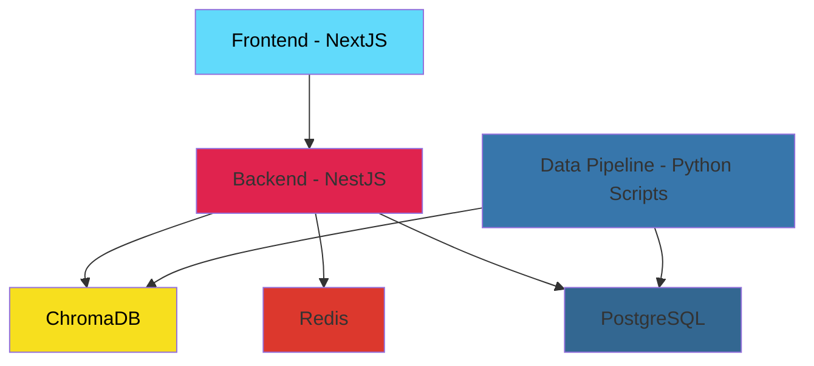

# README

## System Design

The application follows a microservices architecture with the following components:



### Architecture Overview

- **Frontend (NextJS)**: React-based web application providing the user interface
- **Backend (NestJS)**: Node.js API server handling business logic and data processing
- **ChromaDB**: Vector database for similarity search and AI-powered features
- **Redis**: In-memory cache for performance optimization
- **PostgreSQL**: Primary relational database for structured data storage
- **Data Pipeline**: Python scripts for data processing, enrichment, and migration between databases

## Setup Instructions

### Install Spacy en_core_web_sm

```bash
python -m spacy download en_core_web_sm
```
